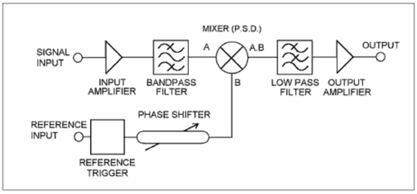

# Lock-in Amplifier (Signal Analysis using Python)

Simulator built to understand how a Lock-in works.

**The source code is not available because the work has not yet been published.**

Generally speaking, a Lock-In amplifier is a dual instrument functionality. Can recover signals present in background noise (background) or even provide a high definition of relatively clean signal measures, such as magnitude and frequency.

To work correctly the PSD must be “programmed” to work in a given frequency band, that is, to recognize only the signal of interest for the measure, eliminating unwanted frequencies. This is done by providing to the detector a reference signal of the same frequency and with a fixed phase related to the input signal.

## Bibliotecas Usadas

- [x] NumPy
- [x] Pandas
- [x] Matplotlib
- [x] Scipy
- [x] Sklearn
- [x] QtPy5

[ANALYSIS AND DEVELOPMENT OF A DIGITAL LOCK-IN AMPLIFIER](http://www.ppgee.eng.ufba.br/tese/62e9c5fdd35710b55ff5da97cb5d305a.pdf)

[AMPLIFICADOR LOCK-IN DIGITAL UTILIZANDO PLACA DE AQUISIÇÃO DE DADOS E MATLAB](http://www.abenge.org.br/cobenge/arquivos/14/artigos/PE-14-04964524442-1117745528492.pdf)
