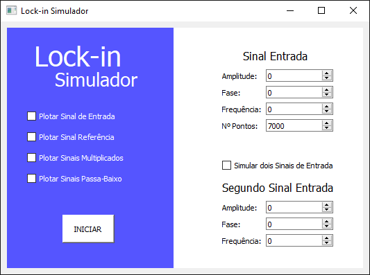

# Amplificador Lock-in (Análise de Sinais usando Python)

Simulador construído para entendimento do funcionamento de um Lock-in.

## Ferramentas Usadas

- [x] NumPy
- [x] Pandas
- [x] Matplotlib
- [x] Scipy
- [x] Sklearn
